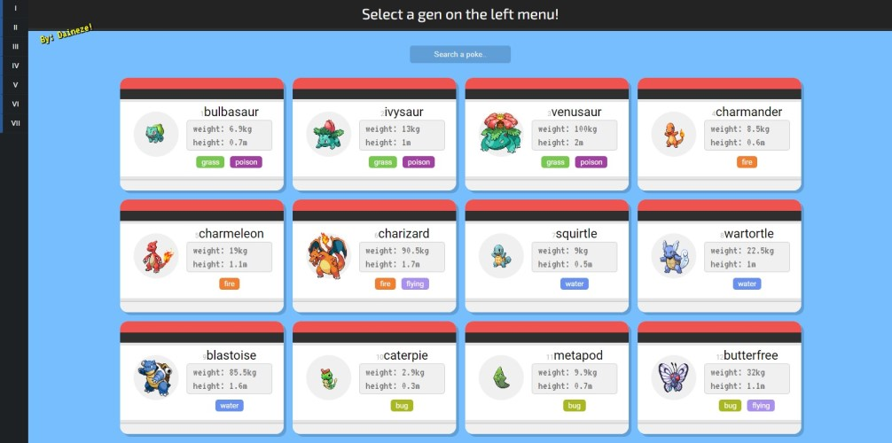
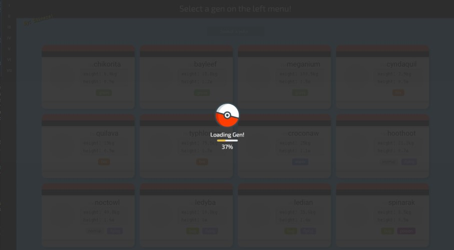
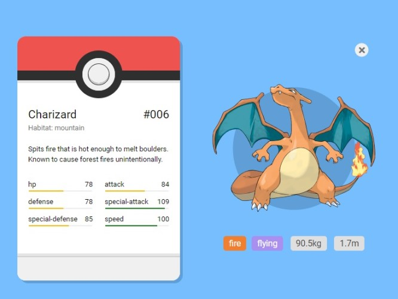

   


## Vue.js PokeAPI

Consumo da PokeAPI 2.0 (https://pokeapi.co/) com a utilização de vue.js + axios

### Preview

É possível ver o resultado do projeto através [DESTE LINK](https://daineze.dev/portfolio/pokeapi/).




### Fontes

1. As principais informações foram retiradas da PokeAPI 2.0;
2. Descrição e habitat foi retirado de uma "sub-consulta" da API;
3. Para as imagens em tamanho grande, foi utilizado o site https://pokeres.bastionbot.org ;
4. As cores utilizadas são baseadas no próprio site da pokeapi, para manter a identidade.



### Como funciona

O sistema de loading usa matematica básica para calcular a porcentagem real de itens carregados pelo axios, uma vez que a consulta alimenta uma array, é possível realizar a consulta de quantas ainda permanecem pendentes.

```js
if (this.pokemons.slice().length != this.limit) {
    this.loading = true;
    this.load_percent = Math.trunc((this.pokemons.slice().length * 100) / this.limit);
} else {
    this.loading = false;
}
```

A descrição não está disponível na consulta padrão, por este motivo é necessário realizar uma segunda consulta com base no id do pokemon.

```js
getDescription(poke) {
    axios.get(`https://pokeapi.co/api/v2/pokemon-species/${poke.id}`).then(r => {
        this.specie = r.data;
        this.description = String(this.specie.flavor_text_entries[0].flavor_text).replace(/[^A-Za-z.,; ]/g, ' ');
    });
},
```

Uma vez que não existe um padrão fixo de "status maximo" para os pokemons (apenas algumas poucas referencias de pokemons mais fortes), os status são demonstrados com base no valor mais alto encontrado, assim, trazendo não de forma comparativa entre pokemons, mas sim ressaltando os status mais fortes/importantes de um pokemon

```js
getInfo(poke) {
    this.getDescription(poke);
    this.infos = poke;
    this.info = true;
    this.maxstatus = 0;
    poke.stats.forEach(e => {
        if (e.base_stat > this.maxstatus) this.maxstatus = e.base_stat + 5;
    });
},
```

Tanto HTML quanto JS contam com somente 100 linhas, é uma aplicação simples e completa. O design não utiliza nenhum tipo de framework, apenas um arquivo de reset.
